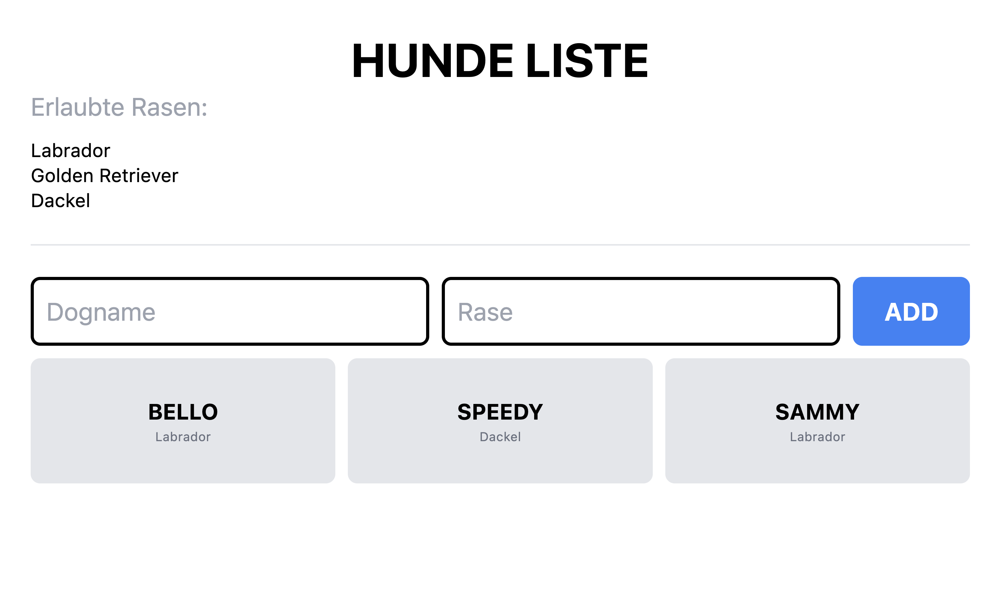

# Run the project

## Type in commant line :

- npm run dev

---

# The Task

### Dog-Example (React-Basics)

- Erlaubte Hunderasen:
  "Labrador",
  "Golden Retriever",
  "Dackel",
- Hundename muss mehr als 3 Zeichen beinhalten (>3 characters)
- User soll informiert werden wenn der Name nicht passt oder die Rase nicht erlaubt ist (Rote Umrandung bei Inputfeld ansonsten eine grüne wenn alles OK ist)
- Es soll nicht möglich sein einen Hund hinzuzufügen wo der Name oder die Rase nicht passt (evtl Errormessage oder Button nicht klickbar)
- Responsive

---

